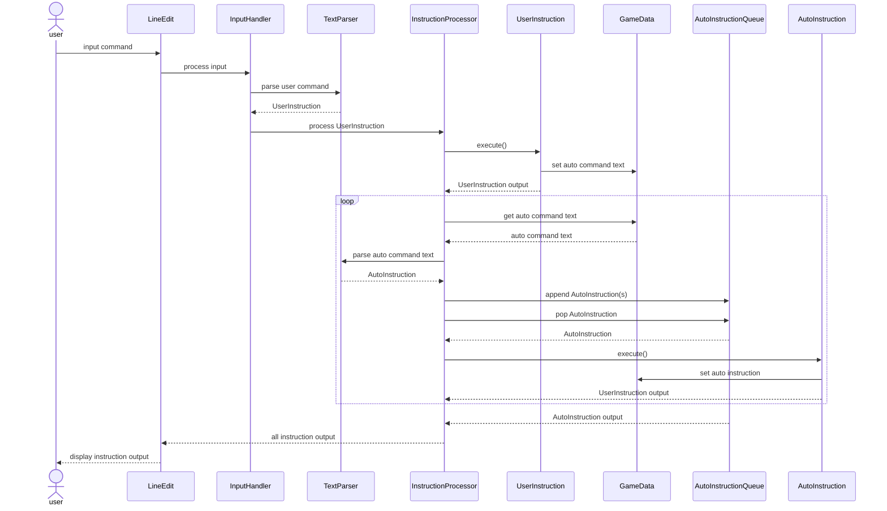

# ADR 2: Instruction Processing System
## CONTEXT
I want to be able to trigger some behavior upon completion of an instruction. For example, for [gh-60](https://github.com/narruda789/people-collector-poc/issues/60), I want Alya to receive a gift as a result of talking to her sister.

I like the idea of introducing "auto instructions" that can be defined in the game data JSON and run automatically at the given time.

In the current system, instructions are pretty tightly coupled to the UI. I want to refactor the system with a few goals:
1. Distinguish between a `UserInstruction` and an `AutoInstruction`. They can do the same kind of thing, but they are triggered under different circumstances.
2. Create a syntax for auto instructions in JSON. This can include some metadata about the instruction; for example, whether it's a one-time instruction or should repeat on every execution of the associated user instruction.
3. Establish better separation of responsibilities. UI nodes like `LineEdit` should contain as little logic as possible, and collaborators should be written with a test-first approach.

## DECISION
I will use this design as a guide:



I will use the following guide for auto instructions in game data JSON:
```
"on_<instruction>" : {
  "one_time" : boolean,
  "instruction" : {
    "type" : <get | print | ...>,
    ... <other properties>
  }
}
```

Example:
```json
"on_talk" : {
  "one_time" : true,
  "instruction" : {
    "type" : "get",
    "item" : {
      "displayName" : "Dagger",
        "modifiers" : {
          "defense" : 1
        },
        "description" : "A beautiful stiletto dagger...",
    }
  }
}
```

## IMPACT
This design lets me treat instructions as interchangeable modules, which will make it easy to write automated tests for various instruction combinations.

It abstracts a lot of logic away from the UI, so I might even be able to include some end-to-end tests.

It relies heavily on inheritance, specifically overriding methods, which is not super safe in GDScript. I might want to be careful to give override methods pretty specific names/signatures to avoid accidentally overriding functions on Godot objects.

This is the plan for now, but the plan may change. I'll update this picture as I go.